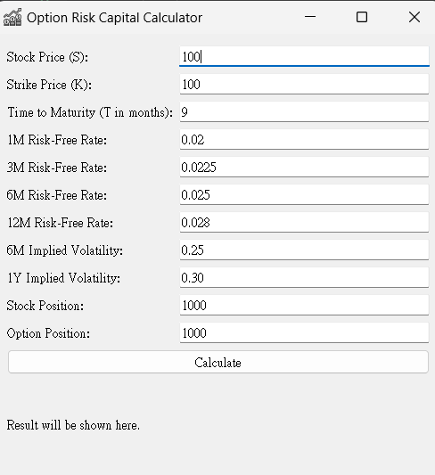

#   Option Risk Capital Calculator Based on Basel III Using QuantLib Python
NTNU 61247014S陳昱誠、NTU R12723057 王智鵬
## Introduction
* 此專案根據巴塞爾協議III(Basel III)來進行選擇權風險技術之視窗工具，透過使用Python Object-Oriented Programing以及QunatLib Python的方式去進行金融模型的模擬與視窗程式實現，此外為了方便測試亦編成一執行檔讓使用者可以在任何環境下皆能執行。

## Introduction to Basel III:
* 巴塞爾協議III是國際清算銀行（BIS）巴塞爾銀行監理委員會提出的銀行業監理架構。其目標是增強銀行體系的穩健性，透過更嚴格的資本要求和引入新的流動性要求來減少銀行倒閉的風險。 Basel III要求銀行持有更高品質的資本，並涵蓋更多的風險敞口，包括市場風險、信用風險和操作風險。

## Calculation Methodology
* 在這個專案中，我們使用Black-Scholes-Merton模型來定價歐式買權。此模型的定價公式如下：
\[ C(S, t) = S \cdot N(d_1) - K \cdot e^{-r(T-t)} \cdot N(d_2) \]

其中:
\[ d_1 = \frac{\ln(S/K) + (r + \sigma^2/2)(T-t)}{\sigma\sqrt{T-t}} \]
\[ d_2 = d_1 - \sigma\sqrt{T-t} \]

- \( S \): 當前股票價格
- \( K \): 執行價格
- \( T \): 到期時間
- \( r \): 無風險利率
- \( \sigma \): 波動率
- \( N \): 標準常態分配的累積分佈函數


### Risk Capital Calculation Formula
根據Basel III框架，我們需要計算選擇權的Delta和Vega，以評估市場創投需求。風險資本的計算公式如下：

\[ \text{市場創投} = \Delta \times \text{股票部位} \times S + \text{Vega} \times \text{選擇權部位} \times \sigma \]

## Program Design
### Technical Framework and Tools
- **程式語言**: Python
- **金融計算庫**: QuantLib
- **圖形使用者介面庫**: PyQt5
- **開發環境**: python3.11.9
### User Interface Design
程式的使用者介面使用PyQt5創建，包含以下元素：
- 輸入欄位：用於輸入股票價格、執行價格、到期時間、無風險利率、波動率等參數。
- 計算按鈕：用於觸發計算。
- 結果標籤：用於顯示計算結果，包括選擇權價格、Delta、Vega和市場風險資本。

## Results
### Application Interface
* 說明:
程式執行後會預設輸入本次題目之參數: 股票價格、執行價格、到期時間、無風險利率、波動率。
根據所輸入的參數可計算出:選擇權價格、Delta、Vega、市場風險資本以及執行時間。

*圖一:程式執行後初始狀態*<br>

*圖二:按下"Calculate"按鈕後秀出結果*
## Conclusion
* 透過此次期末作業，我們成功實現了基於巴塞爾協定III（Basel III）架構的選擇權風險資本計算工具，即使在非專業環境中也能輕鬆運作。正如老師在課堂上所提到的，QuantLib 是一個非常傑出的程式庫，提供了先進的金融模型，解決了金融工程師不懂程式、IT 人員不懂金融工程的重大障礙。此外，QuantLib 確保了計算結果的準確性和可靠性。通過優化程式碼結構和計算流程，我們顯著提高了計算效率，能夠快速輸出結果。相信通過不斷使用 QuantLib 進行實作，我們可以有效提升金融工程能力，解決更多複雜的金融問題與挑戰！
## Code
### QuantLib Objects & Functions:
1. Date().todaysDate():
    * 返回當前的系統日期
2. Settings.instance().evaluationDate:
    * 獲取 QuantLib 的評估日期，用於設定金融計算中所使用的當前日期。
3. QuoteHandle():
    * 用於管理 Quote 物件的生命周期和存取，確保引用的數據始終有效。
4. SimpleQuote():
    * 表示一個簡單的報價，通常是價格或利率。
5. Actual365Fixed():
    * 假設一年有365天，用於計算年化利率。
6. YieldTermStructureHandle():
    * 用於管理 YieldTermStructure 物件，這些物件表示從今天到未來某一日期的利率。
7. NullCalendar():
    * 表示一個不考慮任何假期的日曆。
8. BlackVolTermStructureHandle():
    * 基於 Black 模型的波動率曲線。
9. PlainVanillaPayoff():
    * 定義期權的支付結構，通常包括執行價格和期權類型（如看漲或看跌）。
10. Option.Call():
    * 看漲期權。
11. Period():
    * 時間週期，在 QuantLib 中常用於設定期限。
12. Days():
    * 用於設定 Period 類的時間單位。
13. EuropeanExercise():
    * 用於定義歐式期權的行權特性，即只能在到期日行權。
14. EuropeanOption():
    * 定義歐式期權，包含支付函數和行權方式。
15. BlackScholesMertonProcess():
    * 定義基於 Black-Scholes-Merton 模型的價格運動過程，包括現貨價格、利率、股息和波動率。
16. setPricingEngine():
    * 特定的定價引擎分配給期權，以便計算其價格和Greeks。
17. AnalyticEuropeanEngine():
    * 使用解析解法來定價歐式期權，基於 Black-Scholes-Merton 模型。
18. NPV():
    * 計算期權的淨現值（價格）
19. delta():
    * 返回期權的 Delta 值，即期權價格對標的資產價格變動的敏感度。
20. vega():
    * 返回期權的 Vega 值，即期權價格對標的資產波動率變動的敏感度。
### Source Code:
```python
import sys
import time
from PyQt5.QtWidgets import QApplication, QWidget, QVBoxLayout, QFormLayout, QLineEdit, QPushButton, QLabel
from PyQt5.QtGui import QIcon
import QuantLib as ql
class OptionCalculator(QWidget):
    def __init__(self):
        super().__init__()

        self.initUI()

    def initUI(self):
        self.setWindowTitle('Option Risk Capital Calculator')
        self.setGeometry(300, 300, 500, 500)
        self.setWindowIcon(QIcon('logo.ico'))
        layout = QVBoxLayout()
        formLayout = QFormLayout()
         # Creating input fields for various parameters with default values
        self.s_input = QLineEdit('100')
        self.k_input = QLineEdit('100')
        self.t_input = QLineEdit('9')
        self.r1m_input = QLineEdit('0.02')
        self.r3m_input = QLineEdit('0.0225')
        self.r6m_input = QLineEdit('0.025')
        self.r12m_input = QLineEdit('0.028')
        self.sigma6m_input = QLineEdit('0.25')
        self.sigma1y_input = QLineEdit('0.30')
        self.stock_position_input = QLineEdit('1000')
        self.option_position_input = QLineEdit('1000')

```
```python
       
        
        # Adding input fields to the form layout
        formLayout.addRow('Stock Price (S):', self.s_input)
        formLayout.addRow('Strike Price (K):', self.k_input)
        formLayout.addRow('Time to Maturity (T in months):', self.t_input)
        formLayout.addRow('1M Risk-Free Rate:', self.r1m_input)
        formLayout.addRow('3M Risk-Free Rate:', self.r3m_input)
        formLayout.addRow('6M Risk-Free Rate:', self.r6m_input)
        formLayout.addRow('12M Risk-Free Rate:', self.r12m_input)
        formLayout.addRow('6M Implied Volatility:', self.sigma6m_input)
        formLayout.addRow('1Y Implied Volatility:', self.sigma1y_input)
        formLayout.addRow('Stock Position:', self.stock_position_input)
        formLayout.addRow('Option Position:', self.option_position_input)
        
        self.calculate_button = QPushButton('Calculate')
        self.result_label = QLabel('Result will be shown here.')

        # Connecting button click to the calculation function
        self.calculate_button.clicked.connect(self.calculate_risk_capital)

        layout.addLayout(formLayout)
        layout.addWidget(self.calculate_button)
        layout.addWidget(self.result_label)

        self.setLayout(layout)
```
```python
    def calculate_risk_capital(self):
        start_time = time.time() #start time

        # Reading input values
        S = float(self.s_input.text())
        K = float(self.k_input.text())
        T = float(self.t_input.text()) / 12.0
        r1M = float(self.r1m_input.text())
        r3M = float(self.r3m_input.text())
        r6M = float(self.r6m_input.text())
        r12M = float(self.r12m_input.text())
        sigma_6M = float(self.sigma6m_input.text())
        sigma_1Y = float(self.sigma1y_input.text())
        stock_position = float(self.stock_position_input.text())
        option_position = float(self.option_position_input.text())

        # Interpolating risk-free rate for 9 months
        r = r3M + (r6M - r3M) * (T - 3.0/12.0) / (6.0/12.0 - 3.0/12.0)
        # Interpolating implied volatility for 9 months
        sigma = sigma_6M + (sigma_1Y - sigma_6M) * (T - 6.0/12.0) / (12.0/12.0 - 6.0/12.0)

        # Setting the calculation date
        calculation_date = ql.Date().todaysDate()
        ql.Settings.instance().evaluationDate = calculation_date

        # Creating QuantLib objects for the calculation
        spot_handle = ql.QuoteHandle(ql.SimpleQuote(S))
        flat_ts = ql.YieldTermStructureHandle(ql.FlatForward(calculation_date, r, ql.Actual365Fixed()))
        volatility = ql.BlackVolTermStructureHandle(ql.BlackConstantVol(calculation_date, ql.NullCalendar(), sigma, ql.Actual365Fixed()))

        # Defining the payoff and exercise of the option
        payoff = ql.PlainVanillaPayoff(ql.Option.Call, K)
        exercise = ql.EuropeanExercise(calculation_date + ql.Period(int(T*365), ql.Days))

        # Creating the European option
        european_option = ql.EuropeanOption(payoff, exercise)
        bsm_process = ql.BlackScholesMertonProcess(spot_handle, flat_ts, flat_ts, volatility)

        # Setting the pricing engine
        european_option.setPricingEngine(ql.AnalyticEuropeanEngine(bsm_process))

        # Calculating option price and risk measures
        option_price = european_option.NPV()
        delta = european_option.delta()
        vega = european_option.vega()

        # Calculating market risk capital
        market_risk_capital = (delta * stock_position * S) + (vega * option_position * sigma)

        end_time = time.time()# end time
        execution_time = end_time - start_time #duration

        # Displaying the results
        self.result_label.setText(f"Option Price: {option_price}\nDelta: {delta}\nVega: {vega}\nMarket Risk Capital: {market_risk_capital}\nExecution Time: {execution_time:.8f} seconds")

def main():
    app = QApplication(sys.argv)
    ex = OptionCalculator()
    ex.show()
    sys.exit(app.exec_())

if __name__ == '__main__':
    main()

```
