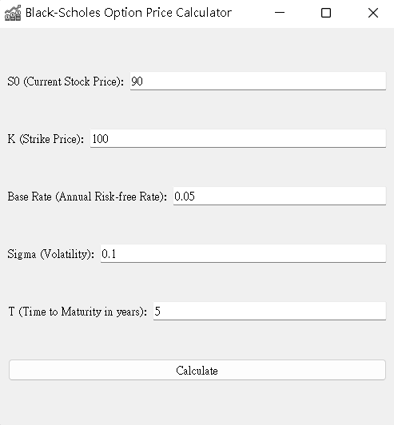
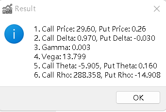

# Mid term
## Introduction
### Black-Scholes Model:
* 用來評估歐式期權(European options)價格的數學模型，他基於幾個假設：
    1. 資產價格會根據對數常態分佈。
    2. 市場無交易成本，可以無限制地借貸。
    3. 利率與波動率為恆定。
* 在此模型中期權價格可以透過當前股票價格、執行價格、到期時間、無風險利率以及股票價格波動率來計算。

### Term Structure
* 期限結通常指的是不同到期時間的債券或無風險利率的結構，它表明了不同時間長度的債券或者貸款的收益率。在Black-Scholes Model中通常使用一個恆定的無風險利率。然而現實中的無風險利率可能隨著時間的不同而變化，這種變化可以通過期限結構來描述。
* 通常使用Term Structure可以使模型更加準確反映當前市場情況。

### Greeks
* Greeks用來描述期權價格對市場變量(價格、波動率、時間流逝等)變化的敏感程度，他們事風險管理工具，幫助投資者了解和管理期權持倉的風險。
* 以下是Greeks的解釋：
    * Delta: 表示股票價格變動對期權價值的影響。
    * Gamma: 表示股票價格變動對Delta的影響。
    * Theta: 表示隨時間推移期權價格的變化速度。
    * Vega: 表示波動率對期權價值的影響。
    * Rho: 表示利率變化對期權價值的影響。

## Implementation

